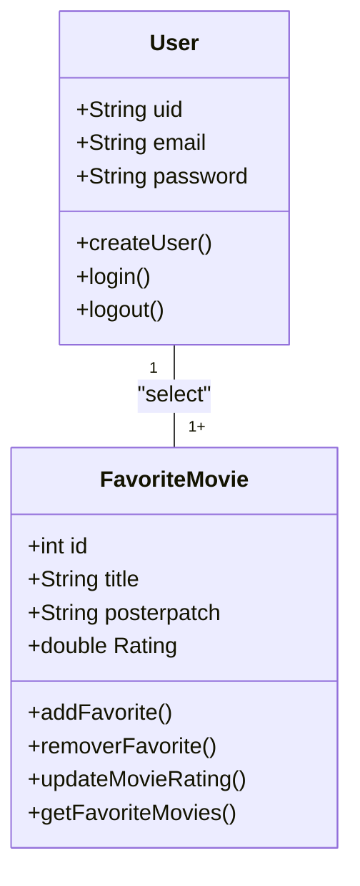
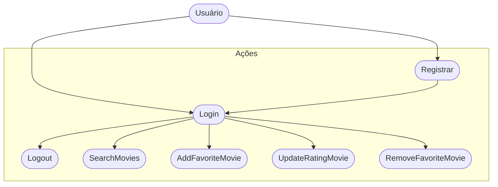
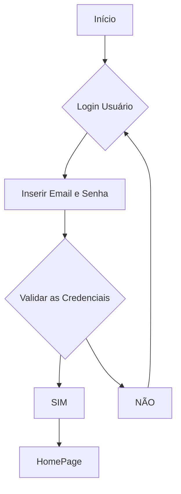

# Cine Favorite ( Formativa )

Construir um aplicativo do 0 - O CineFavorite que permitirá criar uma conta e buscar filmes em uma API e montar uma galeria pessoal de filmes favoritos, com poster e nota avaliativa do usuário par o filme.

## Objetivos

- Criar uma Galeria Personalizada por Usuário de Filmes Favoritos
- Conectar o APP com uma API ( base de dados ) de filmes ( TMDB )
- Permitir a criação de contas para cada usuário

## Levantamento de Requisitos do Projeto

- ### Funcionais

- ### Não Funcionais

## Recursos do Projeto

- Linguagem de Programação : Flutter / Dart
- API TMDB : Base de Dados para filmes
- Firebase : Authentication / FireStore
- Figma : Prototipagem
- VSCode
- GitHub

## Diagramas

1. Classe
   Demonstrar o funcionamento das entidades do sistema

- Usuário ( User ): Classe já modelada pelo FirebaseAuth

  - Atributos : email, senha, uid
  - Métodos : login, registrar, logout

- Filmes Favoritos ( FavoriteMovie ) : Classe Modelada pelo DEV
  - Atributos : id, título, PosterPatch, Nota
  - Métodos : adicionar, remover, listar, atualizarNota ( CRUD )

2. ### Uso
   Ação que os Atores podem Fazer

- Usuário (User):
  - Registrar
  - Login
  - Logout
  - Procurar Filmes na APi
  - Salvar Filmes aos Favoritos
  - Dar Nota aos Filmes Favorito
  - Remover Filme dos Favoritos

3. ### Fluxo
   Determina o Caminho Percorrido pelo Ator para Executar uma Ação

- Fluxo da Ação de Login

## Prototipagem

Link dos Protótipos

## Codificação

- Service --> Conectar com a API
- Model --> Favorite Movie
- Controller --> FireStore DataBase(Incompleto)
- View --> Registro, Login, FavoriteView, SearchView
