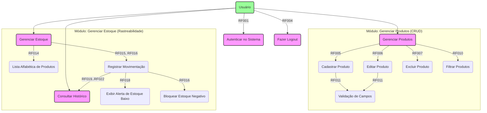

# Projeto: SGA - Sistema de Gestão de Almoxarifado

## 1. Visão Geral do Sistema (Entrega 1)

O "SGA - Sistema de Gestão de Almoxarifado" é uma aplicação multiplataforma (web, mobile) desenvolvida em Flutter e Dart. O objetivo do sistema é fornecer uma solução robusta e de baixo custo para o gerenciamento de ferramentas e materiais, com foco na rastreabilidade e controle de estoque em tempo real.

O sistema utiliza o Firebase como backend (BaaS - Backend as a Service), aproveitando o Firebase Authentication para segurança de acesso e o Cloud Firestore para persistência de dados em tempo real (NoSQL).

---

## 2. Como Testar (Credenciais)

Para avaliar o aplicativo, utilize as seguintes credenciais de teste (previamente cadastradas no Firebase Authentication do projeto):

* **E-mail:** `teste@gmail.com`
* **Senha:** `Senha123`

---

## 3. Requisitos Funcionais (RFs) (Entrega 2)

### Módulo: Autenticação
* **RF001:** O sistema deve permitir que usuários se autentiquem usando e-mail e senha.
* **RF002:** O sistema deve validar as credenciais no Firebase Authentication e fornecer feedback em caso de falha.
* **RF003:** O sistema deve identificar o usuário logado para fins de rastreabilidade.
* **RF004:** O sistema deve permitir que o usuário faça logout.

### Módulo: Cadastro de Produto
* **RF005:** O sistema deve permitir o cadastro de novos produtos.
* **RF006:** O sistema deve permitir a edição dos dados de um produto.
* **RF007:** O sistema deve permitir a exclusão de um produto.
* **RF009:** O sistema deve armazenar os produtos na coleção `Produtos` do Cloud Firestore.
* **RF010:** O sistema deve permitir a busca/filtro de produtos por nome ou descrição.
* **RF011:** O sistema deve validar campos obrigatórios no formulário de produto.

### Módulo: Gestão de Estoque
* **RF014:** A interface de gestão deve listar os produtos em ordem alfabética.
* **RF015:** O sistema deve permitir o registro de **Entrada** de estoque.
* **RF016:** O sistema deve permitir o registro de **Saída** de estoque, impedindo que o estoque fique negativo.
* **RF018:** O sistema deve emitir um **alerta** se uma saída deixar o `estoque_atual` abaixo do `estoque_minimo`.

### Módulo: Rastreabilidade (Logs)
* **RF019:** Cada operação de entrada ou saída deve gerar um registro (log) na coleção `Movimentacoes`.
* **RF020:** O log de movimentação deve registrar qual usuário (email) realizou a operação.
* **RF021:** O log deve registrar o tipo, a quantidade e a data/hora da operação.
* **RF022:** O log deve permitir o registro da data efetiva da movimentação (informada pelo usuário).

---

## 4. Diagrama de Casos de Uso (Entrega 1)

O diagrama abaixo descreve as interações dos usuários (atores) com as principais funcionalidades do sistema.



---

## 5. Diagrama de Entidade NoSQL (Entrega 3)

Abaixo está o diagrama de coleções e documentos para o Cloud Firestore, modelado em `mermaid`.

```mermaid
graph TD
    subgraph "Cloud Firestore"
        direction TB
        
        Col_Produtos["<b>Produtos (Coleção)</b><br_><i>/Produtos</i>"]:::colecao
        Doc_Produto["<b>{produtoId_auto} (Documento)</b><br_>nome: String<br_>descricao: String<br_>peso_kg: Number<br_>dimensoes_cm: String<br_>estoque_atual: Number<br_>estoque_minimo: Number"]:::documento
        
        Col_Movimentacoes["<b>Movimentacoes (Coleção)</b><br_><i>/Movimentacoes</i>"]:::colecao
        Doc_Movimentacao["<b>{movimentacaoId_auto} (Documento)</b><br_>produto_id: String (Ref. Produto)<br_>produto_nome: String<br_>tipo: String ('Entrada'/'Saída')<br_>quantidade: Number<br_>data_movimentacao: Timestamp<br_>data_hora_operacao: Timestamp<br_>usuario_id: String (Ref. Auth)<br_>usuario_email: String"]:::documento

        Col_Produtos -- "Contém" --> Doc_Produto
        Col_Movimentacoes -- "Contém (Logs)" --> Doc_Movimentacao
        Doc_Movimentacao -- "Refere-se a" -.-> Doc_Produto
    end

    classDef colecao fill:#FFC,stroke:#333,stroke-width:2px,color:#333
    classDef documento fill:#DEF,stroke:#333,stroke-width:2px,color:#333
```

---

## 6. Stack de Tecnologia e Infraestrutura (Entregas 2 e 9)

* **9.1.1. SGBD:** Google Firebase (BaaS)
    * **Cloud Firestore:** Banco de dados NoSQL em tempo real.
    * **Firebase Authentication:** Serviço de autenticação (provedor E-mail/Senha).
* **9.1.2. Linguagem/Framework:**
    * **Linguagem:** Dart (v3.x)
    * **Framework:** Flutter (v3.x)
* **9.1.3. Sistema Operacional:**
    * **Desenvolvimento:** Windows, macOS ou Linux.
    * **Execução (Cliente):** Web (Google Chrome), Android (API 21+) e iOS (11.0+).

---

## 7. Descritivo de Teste de Software (Entrega 8)

Este documento descreve as ferramentas, ambiente e casos de teste (CT) para validar os requisitos funcionais do Sistema de Gestão de Almoxarifado (SGA).

### 8.1. Ferramentas e Ambiente

* **Ferramentas de Teste:**
    1.  **Flutter Driver (`integration_test`):** Para testes de integração e End-to-End (E2E), simulando a jornada completa do usuário (login -> cadastro -> logout).
    2.  **Flutter Test (`flutter_test`):** Para testes de widgets, validando se cada tela reage corretamente a interações.
    3.  **Firebase Emulators (Local Emulator Suite):** Ferramenta **essencial** para os testes. Permite rodar uma versão local do Firebase (Auth e Firestore) para que os testes automáticos não poluam o banco de dados de produção.

* **Ambiente de Teste:**
    * **Sistema Operacional:** Windows 11 / macOS (com Flutter SDK instalado).
    * **Dispositivos:** Emulador Android (Pixel 7 API 33) e Google Chrome (para a versão Web).
    * **Banco de Dados:** Instância local do Firebase Emulator (Firestore e Auth).

### 8.2. Casos de Teste por Requisito Funcional

#### Módulo: Autenticação (RF001, RF002, RF004)

* **CT01: Login com Sucesso**
    * **RF:** RF001
    * **Passos:** 1. Abrir o app. 2. Digitar e-mail (`teste@gmail.com`) e senha (`Senha123`). 3. Clicar em "ENTRAR".
    * **Resultado Esperado:** O usuário é redirecionado para a tela `/principal`.

* **CT02: Login com Senha Incorreta**
    * **RF:** RF002, 4.1
    * **Passos:** 1. Abrir o app. 2. Digitar e-mail (`teste@gmail.com`) e senha (`errada`). 3. Clicar em "ENTRAR".
    * **Resultado Esperado:** Um diálogo de alerta é exibido com a mensagem "Senha incorreta." (ou similar).

* **CT03: Login com E-mail Inexistente**
    * **RF:** RF002, 4.1
    * **Passos:** 1. Abrir o app. 2. Digitar e-mail (`naoexiste@sga.com`) e qualquer senha. 3. Clicar em "ENTRAR".
    * **Resultado Esperado:** Um diálogo de alerta é exibido com a mensagem "Nenhum usuário encontrado com este e-mail."

* **CT05: Logout e Segurança da Rota**
    * **RF:** RF004, 5.1.2
    * **Passos:** 1. Estar logado na tela `/principal`. 2. Clicar no ícone "Logout". 3. Ser redirecionado para a tela `/login`. 4. Pressionar o botão "Voltar" do navegador ou celular.
    * **Resultado Esperado:** O usuário permanece na tela `/login` e não consegue "voltar" para a tela `/principal`.

#### Módulo: Cadastro de Produto (RF005, RF007, RF010)

* **CT06: Adicionar Novo Produto (CRUD - Create)**
    * **RF:** RF005, 6.1.3
    * **Passos:** 1. Ir para "Cadastro de Produto". 2. Clicar no botão `+` (FAB). 3. Preencher todos os campos obrigatórios. 4. Clicar em "Salvar".
    * **Resultado Esperado:** O diálogo fecha. O novo produto aparece imediatamente na lista (tabela).

* **CT09: Excluir Produto (CRUD - Delete)**
    * **RF:** RF007, 6.1.5
    * **Passos:** 1. Ir para "Cadastro de Produto". 2. Clicar no ícone "Excluir" (lixeira) de um produto. 3. Confirmar a exclusão no diálogo de alerta.
    * **Resultado Esperado:** O diálogo fecha. O produto desaparece da lista.

* **CT10: Filtro de Busca (Real-time)**
    * **RF:** RF010, 6.1.2
    * **Passos:** 1. Garantir que a lista tenha "Martelo Unha" e "Chave de Fenda". 2. Digitar "Martelo" no campo de busca.
    * **Resultado Esperado:** A lista se atualiza automaticamente, mostrando apenas "Martelo Unha".

#### Módulo: Gestão de Estoque (RF015, RF016, RF018, RF019)

* **CT11: Registrar Movimentação de Entrada e Log**
    * **RF:** RF015, RF019
    * **Passos:** 1. Ir para "Gestão de Estoque". 2. Selecionar um produto (Estoque atual: 50). 3. Selecionar "Entrada". 4. Digitar "10" no campo Quantidade. 5. Clicar em "SALVAR".
    * **Resultado Esperado:** 1. O `estoque_atual` do produto no Firestore é atualizado para 60. 2. Um novo documento é criado na coleção `Movimentacoes` com `tipo: "Entrada"`.

* **CT12: Registrar Movimentação de Saída (com Alerta)**
    * **RF:** RF016, RF018
    * **Passos:** 1. Ir para "Gestão de Estoque". 2. Selecionar um produto (Estoque atual: 15, Estoque mínimo: 10). 3. Selecionar "Saída". 4. Digitar "6" (Novo estoque será 9). 5. Clicar em "SALVAR".
    * **Resultado Esperado:** 1. Um diálogo de "Atenção: Estoque Baixo" é exibido. 2. O usuário clica em "OK". 3. O estoque é atualizado para 9. 4. Um log de `tipo: "Saída"` é criado.

* **CT13: Bloqueio de Estoque Negativo**
    * **RF:** RF016
    * **Passos:** 1. Ir para "Gestão de Estoque". 2. Selecionar um produto (Estoque atual: 5). 3. Selecionar "Saída". 4. Digitar "6" no campo Quantidade. 5. Clicar em "SALVAR".
    * **Resultado Esperado:** 1. Uma mensagem de erro (Snackbar) é exibida (ex: "Estoque insuficiente..."). 2. O `estoque_atual` no Firestore permanece 5. 3. Nenhum log de movimentação é criado.